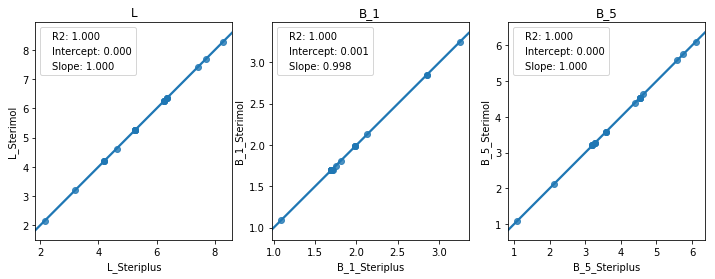

#README IS OUT OF DATE

# Steriplus
A Python package for calculation of steric descriptors. Steriplus can be run
either as a command line script or imported as a module.

## Example
#### Input


## Installation
```
pip install steriplus
```

### Dependencies
* matplotlib
* numpy
* scipy

## Usage
### Command line
```
steriplus <input file> <atom1> <atom2> --radii <radii-type> --density <density>
-v/--verbose
```  
or  
```
python -m steriplus <input file> <atom1> <atom2> --radii <radii-type> --density
<density> -v/--verbose
```

|Argument   | Description                                                    |
|-----------|----------------------------------------------------------------|
|input file | .xyz or Gaussian .gjf or .com                                  |
|atom1      | Index of dummy atom                                            |
|atom2      | Index of atom in the substituent connected to the dummy atom   |
|radii      | Type of van der Waals radii to use: "bondi" or "crc" (default) |
|density    | Density of points. Default value is 0.005 points/Å<sup>2</sup> |
|v/verbose  | Print uncorrected L and bond length between atom 1 and atom 2  |

### Module
#### Imports
```
from steriplus import read_gjf, read_xyz
from steriplus import Sterimol
```

#### Usage
##### Getting parameters
```
>>> elements, coordinates = read_xyz("isobutane.xyz")
>>> sterimol = Sterimol(elements, coordinates, 2, 1)
>>> sterimol.L_value
4.1692354497110005
```

#### More info
```
help(Sterimol)
```

## Background




### References


## Change log
